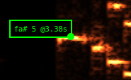

# Web FFT 4 Bb instruments

       ___- - -____/|
        (__|||__)  \|

This tool creates a spectral analysis from captured sound
but instead of frequencies you see musical notes for B flat instruments.

Try it:
https://bdelbosc.github.io/webfftbb/dft/

-------------------
All credits goes to the excellent [Webfft](https://github.com/webfft/webfft.github.io).
